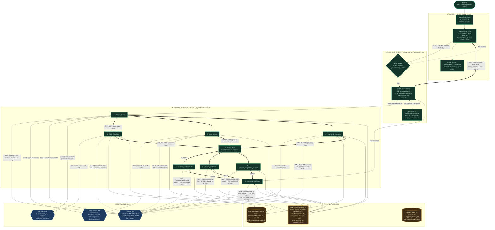

# Verdikt — Hackathon Submission

**An investment research agent that returns the reasoning graph, not just the answer.**

| | |
|---|---|
| **Repository** | https://github.com/ankan00V/Verdikt1 |
| **Live demo** | https://verdikt-ashy.vercel.app/research |
| **Demo video** | https://www.loom.com/share/93450b55bd7d4414ae6ade2cabcb828b |
| **Team** | Solo — Ankan Ghosh |
| **Track** | Agents & Automation |
| **Constraints declared** | **(2) Degrade gracefully** and **(3) Handle being wrong** — evidence in §9 |
| **Stack** | Next.js 16 · LangGraph.js 1.4 · Llama 3.1 70B via NVIDIA NIM · Tavily · Yahoo Finance · Upstash Redis · Vercel |

---

## 1. At a glance

You type a company name and its official website. Ninety seconds later you have an **INVEST** or **PASS** verdict with a confidence number — and, more importantly, the nine labelled research stages that produced it, each one clickable and independently inspectable.

The product is not the verdict. The product is that you can audit the verdict.

### Could this have existed in 2023?

**No — and here is the honest, specific version of that claim.**

A 2023 team could have built something that *looks* like this: GPT-4, a finance API, a search API, and regex over free text. What they could not have built is the thing this project actually depends on — **a nine-node graph where every node emits a schema-valid typed object that the next node consumes as structured input.**

Three things had to become true first:

1. **LangGraph.js did not exist in usable form.** LangGraph's Python release landed in early 2024; the JavaScript `StateGraph` with `Annotation.Root` and per-key reducers — which is the entire concurrency model of this project — reached 1.0 in 2025. Verdikt runs on `@langchain/langgraph@1.4.4`. The parallel fan-out/fan-in with typed reducers is not something you hand-roll in an afternoon.
2. **Constrained decoding on open-weights models did not exist.** Llama 3.3 shipped December 2024; NIM's JSON-schema-constrained output came with it. In 2023 you got a 70B model to emit JSON by *asking nicely* and then repairing the output. Verdikt has **zero JSON repair code** in its analysis path because `withStructuredOutput(ZodSchema)` makes malformed output structurally impossible. Every downstream node reads `state.fundamentalsAnalysis.overallScore` as a four-value enum and trusts it.
3. **A free-tier 70B behind an OpenAI-compatible endpoint** is what makes the cost model (§12) work at all. In 2023 this pipeline's six model calls per run would have gone to GPT-4 at roughly 40× the price.

Remove any one of those and you get a different, worse project.

---

## 2. What I built

Verdikt is a **multi-node LangGraph.js research agent** deployed as a Next.js app. Given a company name plus its official website, it:

1. Verifies the name and the website actually refer to the same entity — and **refuses** if they don't.
2. Resolves the entity to a stock ticker, then validates that ticker against live market data.
3. Fans out to three independent evidence-gathering nodes in parallel: financials, news, competitive web research.
4. Fans in, then fans out again to three independent LLM analysts — fundamentals, sentiment, competitive position — each producing a separate structured artifact.
5. Fans in a final time to a synthesis node that must cite the three prior artifacts and is forbidden from introducing new information.
6. Streams every stage to the browser over SSE as it happens, so the user watches the reasoning assemble rather than waiting on a spinner.

Nine nodes. Six model calls on the happy path. Four Zod-enforced output contracts. Zero free-text parsing in the analysis chain.

### 2.1 Who exactly has this problem

Not "investors." Specifically: **the analyst two years into a job at a small fund or a family office who is handed eight tickers on Monday morning and told to have a view by Wednesday.**

That person's real constraint is not information access — Yahoo Finance is free and the news is free. Their constraint is that the first-pass triage on eight names takes two days of tab-juggling, and their boss will ask "why?" about whichever three they flag. A ChatGPT summary is useless to them for exactly one reason: **they cannot defend it in a meeting.** "The model said so" ends a career conversation badly.

Verdikt's output is defensible in that meeting because the confidence number is attached to a visible data-quality note, the fundamentals summary is required to cite actual figures from the fundamentals node, and if the financial data never arrived, the run *says so on its face* and caps its own confidence at 55.

The second, larger group: **the retail investor who is about to make a decision from a Reddit thread.** Verdikt does not tell them what to buy. It shows them the shape of a real research process — what evidence exists, what's missing, and what the counter-case is.

---

## 3. How it works

### 3.1 Architecture

Every box, arrow, model call and data store is labelled. `LLM` markers indicate an actual inference call.



**Reading the arrows:** solid `==>` are graph edges (execution order). Solid `-->` are outbound calls. Dotted `-.->` are degradation paths that only fire when the primary source fails.

### 3.2 The nine nodes

| # | Node | Type | Input it reads | Output it writes | Fails how |
|---|------|------|----------------|------------------|-----------|
| 1 | `resolve_ticker` | LLM + search + validate | `companyName`, `website` | `ticker` | **Hard-throws** on identity mismatch (deliberate refusal). Soft-fails to `errors[]` if no ticker found. |
| 2 | `fetch_financials` | API (parallel) | `ticker` | `financials`, `companyProfile`, `financialsAvailable` | Falls back to LLM-recalled financials; then to `financialsAvailable: false` |
| 3 | `fetch_news` | API (parallel) | `ticker`, profile name | `newsResults[]` | Falls back to LLM-recalled headlines; then to empty array + error |
| 4 | `fetch_web_research` | API (parallel) | `ticker`, `website`, sector | `webResearchResults[]` | Same two-tier fallback |
| 5 | `gather_data` | Barrier | — | `{}` | Cannot fail — it does no work. It exists so the fan-in point is *visible in the graph* rather than implied by edge topology. |
| 6 | `analyze_fundamentals` | **LLM** | `financials`, `companyProfile` | `fundamentalsAnalysis` | Returns a valid `overallScore: "unavailable"` object — never crashes the graph |
| 7 | `analyze_sentiment` | **LLM** | `newsResults[]` | `sentimentAnalysis` | Returns neutral/score-50 degraded object |
| 8 | `analyze_competitive_position` | **LLM** | `webResearchResults[]`, profile | `competitiveAnalysis` | Returns `moatScore: "unclear"` degraded object |
| 9 | `synthesize_decision` | **LLM** | outputs of 6, 7, 8 + data flags | `decision` | Writes to `errors[]`; UI shows the failure rather than a fabricated verdict |

Nodes 6–8 never see raw API responses. They see only the slice of state they need. Node 9 never sees raw API responses *or* raw analysis prose — it receives a compressed JSON projection of the three prior artifacts plus a `dataFlags` block, and its system prompt has eight numbered rules, of which rule 8 is a hard confidence ceiling.

### 3.3 What a request actually does

```
POST /api/research  { company, website, thread_id? }
  ├─ rate-limit check (10/hr/IP) ......................... 429 if exceeded
  ├─ env preflight (NVIDIA_NIM_API_KEY, TAVILY_API_KEY) ... 500 with named vars if missing
  ├─ open ReadableStream, return Response immediately
  └─ inside start(controller):
       ├─ new UpstashSaver()  →  buildGraph(checkpointer)
       ├─ emit  { type: "thread_created", thread_id }
       ├─ for await (event of graph.streamEvents(input, { version: "v2" })):
       │     ├─ skip events with no langgraph_node metadata
       │     ├─ skip events where event.name !== nodeName   ← filters inner LLM runnables
       │     ├─ on_chain_start  → emit node_start  (deduped via Set)
       │     ├─ on_chain_error  → throw, caught below
       │     └─ on_chain_end    → emit node_complete + full node output
       ├─ emit { type: "done" }
       └─ catch → emit { type: "error", message }
```

Every SSE frame is followed by a 1024-space SSE comment. That padding is not cosmetic — Vercel's Node runtime buffers small chunks, and without it the client receives nine events in one burst at the end, which defeats the entire point of streaming.

If the function is killed at 60 seconds, the client sees the stream close **without** a `done` or `error` frame. `useResearch` treats that specific condition as a timeout, waits 2 seconds, and re-POSTs with the same `thread_id`. The saver rehydrates the graph from Redis, and every already-completed node returns from `node_result:{thread}:{node}` in under 100ms. Up to 10 reconnects.

---

## 4. My contribution and work done

Solo build. Ankan Ghosh — architecture, all agent code, all UI, deployment, and debugging.

I used an LLM assistant the way the brief describes as legitimate: to generate boilerplate, throwaway probe scripts, and to parse API documentation I didn't want to read. The 32 files in `scripts/` and `tests/` are almost entirely that — disposable probes against Yahoo, Tavily, and NIM to discover actual response shapes. The transcript in `llm_chat_logs/CHAT_LOG_READABLE.md` is the unedited record.

What I did *not* delegate, because it isn't delegable: the state schema and its reducers, the fan-in topology, the failure taxonomy, the checkpoint serialization, and every hour spent finding out why the thing that worked locally died on Vercel.

### 4.1 What the API gave me vs. what I built

This is the question the brief says most teams can't answer. Here is the honest boundary.

**What I got for free:**

| Free | What it does |
|---|---|
| NVIDIA NIM endpoint | Takes messages, returns schema-valid JSON. One HTTP call. |
| `withStructuredOutput(schema)` | LangChain converts Zod → JSON Schema and constrains decoding. |
| `yahoo-finance2` | `quoteSummary(ticker, { modules })` → typed financial objects. |
| Tavily | A query string in, ranked article objects out. |
| `StateGraph` / `MemorySaver` | Node registration, edge scheduling, in-memory checkpointing. |
| Next.js / Vercel | Routing, streaming Response, deploy. |

**What none of that gave me — this is the project:**

1. **A state schema whose reducers survive parallel writes.** Three nodes finishing in the same super-step and both touching `errors` is a `INVALID_CONCURRENT_GRAPH_UPDATE` crash by default. Every concurrently-written key in `state.ts` carries an explicit reducer; `newsResults`, `webResearchResults` and `errors` concatenate, scalars last-write-wins. This is a design decision per field, not a framework feature.

2. **Correct fan-in.** `addEdge("a", "d"); addEdge("b", "d"); addEdge("c", "d")` does *not* wait for all three — it schedules `d` three separate times. The array form `addEdge(["a","b","c"], "d")` is the barrier. Getting this wrong ran the four LLM analysis nodes three times each, tripled the cost, and produced three conflicting verdicts. Both fan-ins in `graph.ts` use the array form, and the comment marking it says `CRITICAL FIX` because it cost me hours.

3. **A checkpoint saver that works on stateless serverless.** `MemorySaver` is in-memory; Vercel gives you a fresh process. `UpstashSaver` overrides `getTuple`, `put` and `putWrites` to rehydrate from and sync to Upstash's REST API. The non-obvious part is §8.1.

4. **A two-tier degradation ladder on every evidence source.** Yahoo → LLM-recalled financials → explicit unavailable. Tavily → LLM-recalled context → empty + error. Written per node, not generic.

5. **A refusal path.** Before any research happens, an LLM decides whether "Apple" and `anthropic.com` are the same entity, and **throws** if not. This is the only place in the codebase that deliberately kills a run.

6. **Confidence that is structurally coupled to data quality.** Rule 8 of the synthesis prompt: if `dataFlags.financialsAvailable` is false, confidence *must* be ≤55. The model cannot express high conviction on absent evidence.

7. **A retry classifier that knows timeouts are not retryable.** Everything retries three times with 2s/4s backoff and key rotation — *except* timeouts, which fail immediately, because retrying a 45-second timeout inside a 60-second budget guarantees the whole function dies instead of one node.

8. **SSE that survives Vercel.** Padding, `X-Accel-Buffering: no`, all async work inside `start(controller)`, event filtering on `event.name !== nodeName`, and client-side timeout detection driving reconnection.

9. **The interface that makes any of it worth showing** — a three-pane console where the pipeline, the findings feed and the per-node structured output are visible simultaneously and live.

Roughly: the APIs are 200 lines of my code. The other ~2,400 lines are what happens around them.

---

## 5. Key features

| Feature | Where |
|---|---|
| **Nine-node DAG with two parallel fan-out/fan-in stages** | `graph.ts` |
| **Four Zod-enforced output contracts**, self-documenting via `.describe()` on every field | `schemas.ts` |
| **Live SSE console** — pipeline tracker, findings feed, per-node structured detail pane | `useResearch.ts`, `components/verdikt/` |
| **Identity verification with refusal** — mismatched name/website is rejected before any spend | `resolve-ticker.ts` |
| **Ticker candidate validation** — up to 3 LLM-extracted candidates, each checked against a live Yahoo quote | `resolve-ticker.ts` |
| **Two-tier degradation on all three evidence sources** | `fetch-*.ts` |
| **Dual API key rotation with alternating retries** | `llm.ts` |
| **Timeout-aware retry classification** | `llm.ts` |
| **Durable checkpointing across serverless timeouts** — zlib + base64, 1h TTL | `upstash-saver.ts` |
| **Per-node result cache** making reconnects near-free | `redis.ts` |
| **Cache-aside on every external call** — 24h financials, 1h search | `redis.ts` |
| **Auto-reconnect on stream drop**, up to 10 attempts | `useResearch.ts` |
| **Per-IP rate limiting**, 10/hour sliding window | `ratelimit.ts` |
| **Search noise post-filter** — results must mention the ticker or company | `fetch-news.ts`, `fetch-web-research.ts` |
| **Staggered LLM launches** (0 / 500 / 1000ms) to avoid self-inflicted 429s | analysis nodes |
| **Proxy-routed Yahoo Finance** for datacenter-IP blocks | `fetch-financials.ts` |

---

## 6. Technical decisions

| Decision | Alternative | Why I chose it |
|---|---|---|
| **LangGraph `StateGraph`** | Single prompt; or hand-rolled `Promise.all` | The brief's own guidance says hand-rolled loops often beat framework magic — and for a 3-step chain I'd agree. At nine nodes with two fan-in barriers, checkpoint resume, and per-node event streaming, the reducer model and `streamEvents` are load-bearing. I'd have rebuilt both badly. |
| **`MessageGraph` rejected in favour of `StateGraph`** | — | Nothing here is conversational. The unit of accumulation is a typed research finding, not a message. The state schema *is* the specification of what the agent knows. |
| **Llama 3.1 70B on NVIDIA NIM** | Claude / GPT-4 | Everyone in the room has the same frontier API key — the brief says so explicitly. NIM gives an OpenAI-compatible endpoint with schema-constrained decoding on open weights, at free-tier cost. It also forced the design to be robust: a 70B follows an eight-rule synthesis prompt only if the schema does half the enforcement. |
| **`yahoo-finance2`** | Financial Modeling Prep | FMP paywalled its fundamental endpoints mid-build (§8.4). Yahoo needs no key. The cost is that it's scraped and therefore fragile — which is exactly why the degradation ladder exists. |
| **Tavily** | SerpAPI, Brave | Purpose-built for agents: clean content field, native `timeRange`, `topic: "news"` vs `"general"` separation. I use both topics deliberately — news for recency, general for evergreen business analysis. |
| **SSE over WebSockets** | — | Vercel serverless does not support WebSockets. SSE is plain HTTP and unidirectional is all this needs. Cost: reconnect logic instead of a persistent socket (§14). |
| **`fetch` + `ReadableStream` reader over `EventSource`** | — | `EventSource` is GET-only; the company name has to go in a POST body. |
| **Custom `UpstashSaver` over LangGraph Platform** | LangSmith/LangGraph Cloud | Paid, and adds a hop. Extending `MemorySaver` and syncing to a free Upstash tier over REST is ~170 lines and works on any serverless host. |
| **Redis REST (Upstash) over TCP Redis** | — | Serverless functions can't hold TCP connections across invocations. |
| **Per-node cache *and* checkpointing** | Just checkpointing | Belt and braces. Checkpoint restore isn't always complete after a hard kill; the node cache makes any accidental re-run cost ~100ms instead of a fresh LLM call. |
| **`temperature: 0` on every analysis call** | — | Same evidence should yield the same verdict. Divergent verdicts on identical inputs would make the audit trail meaningless. |
| **No auth, no database, no user accounts** | — | Runs are stateless and independent by design. Persistence is the right *next* feature, not this one. |

---

## 7. What Verdikt deliberately does not do

- It does not tell you how much to buy, or when. There is no position sizing, no price target, no entry signal.
- It does not claim to be right. It reports a confidence number that is capped by data quality.
- It does not hide failures. A missing data source shows up as a visible node state and a `dataQualityNote`, not as a silently thinner paragraph.

---

## 8. The challenges — what actually broke

These are in order of how much time they cost me.

### 8.1 `MemorySaver` state is `Uint8Array`, and `JSON.stringify` destroys it silently

**The bug:** checkpoints saved to Redis fine. Restoring them crashed inside LangGraph's deserializer with a `Buffer.concat` type error.

**Why:** `MemorySaver.storage` holds serialized checkpoints as `Uint8Array`. `JSON.stringify(new Uint8Array([12,45]))` does not error and does not produce an array — it produces `{"0":12,"1":45}`. That round-trips through Redis as a perfectly valid JSON object, and blows up only much later when LangGraph tries to treat it as bytes. For a large checkpoint it also inflates the payload by roughly an order of magnitude, straight past Upstash's 1MB value limit.

**The fix** (`upstash-saver.ts`): explicitly `Buffer.from(tuple).toString("base64")` every byte-array on the way out and reverse it on the way in — for both `storage` tuples and `writes` tuples, which have different shapes. Then `zlib.deflateSync` the whole payload and base64 it, with a 900KB guard that skips the save rather than getting rejected by Upstash. The read path also handles three formats — compressed base64, plain JSON string, and pre-parsed object — because I changed the format mid-build and old threads were still live in Redis.

This is the answer to "what was the non-obvious hard part." Nothing about it is visible from the type signatures.

### 8.2 Three edges into one node is not a fan-in

`addEdge("fetch_financials", "gather_data")` written three times schedules `gather_data` three times. Downstream, that meant `analyze_fundamentals`, `analyze_sentiment`, `analyze_competitive_position` and `synthesize_decision` each ran three times — 12 LLM calls instead of 4, three different verdicts racing to write `state.decision`, and a UI flickering between them.

The array form `addEdge(["a","b","c"], "d")` is the barrier. Two lines changed. Hours to find, because the symptom (contradictory verdicts) looks like a prompting problem, not a topology problem.

### 8.3 A 90–120 second pipeline inside a 60 second function

Vercel Hobby caps at 60s. A full run takes 90–120s. Three mechanisms together:

1. `UpstashSaver` persists graph state to Redis after every `put` and `putWrites`.
2. The client detects the specific signature of a timeout — stream closed, no `done`, no `error` — and re-POSTs the same `thread_id` after 2 seconds, up to 10 times.
3. `withNodeCache` wraps all nine nodes, so anything already finished returns from Redis in ~100ms and the run picks up where it stopped.

The user sees a brief pause. They do not see a failure.

### 8.4 Financial Modeling Prep paywalled fundamentals mid-build

FMP moved historical income statements, key metrics and ratios behind a paid tier. Options were: fabricate data, drop fundamental analysis, or re-source. I moved to `yahoo-finance2` — no API key, six `quoteSummary` modules in one call. The graph didn't change; only `fetch_financials` did. That's the argument for the node boundary being where it is.

### 8.5 Yahoo Finance blocks Vercel's datacenter IPs

Worked locally, returned empty on production. Yahoo blocks shared cloud egress. Fixed with `https-proxy-agent` and a free Webshare proxy, passed as a per-call `fetchOptions.agent` — which needed a `@ts-expect-error` because `yahoo-finance2`'s `moduleOptions` typing shifted between v2 and v3. Also added a guard so an empty Yahoo response is *never* cached: caching a rate-limit response for 24 hours poisons every subsequent run for that ticker.

### 8.6 Retrying timeouts is worse than failing

The first retry loop retried everything. Three attempts at a 45-second timeout is 135 seconds inside a 60-second budget — one slow node killed the entire function instead of just itself. Now `isTimeout` short-circuits the loop and throws immediately; only real errors (429s, connection resets, auth failures) get the 2s/4s backoff and the alternate API key. Counter-intuitive, and the opposite of what the README originally claimed.

### 8.7 `streamEvents` v2 tags inner runnables with the parent node

Every LLM call *inside* `analyze_fundamentals` inherits `metadata.langgraph_node === "analyze_fundamentals"`. Naively forwarding those to the UI produced duplicate start events and node_complete frames carrying LLM internals instead of node output. The filter is one line — `if (event.name !== nodeName) continue` — plus a `Set` to dedupe starts.

### 8.8 Vercel buffers small SSE chunks

Nine events arriving simultaneously at the end. Fixed with `X-Accel-Buffering: no` plus a 1KB SSE comment appended to every frame — comments are spec-ignored by clients but large enough to force a flush.

### 8.9 The model confidently resolves the wrong company

Ask for "Apple" and a search-grounded extraction will sometimes hand back a ticker for the wrong entity — an ADR, a delisted shell, a same-named foreign listing. Three layers now: the website is declared the source of truth in the prompt, up to three candidates are extracted and each is validated against a live Yahoo quote, and an LLM identity check runs *first* and hard-throws on a mismatch. If every candidate fails Yahoo validation, the best one is still passed forward — deliberately — so the run degrades into the LLM-fallback path with a visible data-quality note rather than dying.

### 8.10 Search returns adjacent-company noise

Tavily on "Palantir" returns Snowflake and Zscaler coverage. Both search nodes post-filter: title+content must mention the ticker or the company's first word. If filtering empties the result set, that counts as a failure and triggers the LLM fallback rather than feeding an empty array to the analyst node.

### 8.11 Parallel nodes rate-limiting themselves

Three analysis nodes firing simultaneously at one NIM key produced 429s that were entirely self-inflicted. Fixed cheaply: 0/500/1000ms stagger at node entry, plus key alternation on retry.

---

## 9. Constraints declared (2 of 5)

### Declared #1 — Degrade gracefully

Demonstrable live by pulling `TAVILY_API_KEY`, pointing `YAHOO_PROXY_URL` at a dead host, or killing the network mid-run.

| Failure injected | What happens |
|---|---|
| Yahoo returns empty / blocked | LLM-recalled structured financials; run continues |
| Yahoo *and* LLM fallback fail | `financialsAvailable: false`; fundamentals node returns `overallScore: "unavailable"`; synthesis caps confidence at 55 and writes a `dataQualityNote` |
| Tavily fails or returns only noise | LLM-recalled context; run continues |
| NIM returns 429 / connection reset | 3 attempts, 2s/4s backoff, alternating between two API keys |
| NIM times out (>45s) | Fails immediately by design; that node returns a valid degraded object; the other eight nodes still run |
| Vercel kills the function at 60s | Checkpoint restored from Redis, client auto-reconnects, completed nodes replay from cache in ~100ms |
| Redis absent entirely | `redis` is `null`; caching, checkpointing and rate limiting all no-op. Full pipeline still runs locally with zero Upstash config |
| Client disconnects | Stream controller closes silently; no orphaned work |

The property that matters: **no failure produces a fabricated verdict.** Every degradation path either surfaces itself in the output or is structurally forced to lower confidence.

### Declared #2 — Handle being wrong

| Mechanism | Implementation |
|---|---|
| **Visible confidence signal** | 0–100, rendered on the verdict stamp |
| **Confidence structurally capped by data quality** | Synthesis rule 8: `financialsAvailable === false` ⟹ confidence ≤ 55 |
| **Explicit unavailability, not silence** | `overallScore: "unavailable"`, `moatScore: "unclear"`, `available: false`, `dataLimitationNote`, `dataQualityNote` — all first-class schema fields |
| **A refusal path** | Name/website mismatch throws before any research spend |
| **Human review path** | Every node's raw structured output is clickable in the detail pane. The chain is auditable: a reviewer can check whether `fundamentalsSummary` actually reflects `fundamentalsAnalysis` |
| **Anti-hallucination prompting** | Fundamentals: *"DO NOT HALLUCINATE OR CALCULATE NUMBERS. Use only the explicitly provided percentages."* Synthesis: *"do not introduce new information."* |
| **Grounding by construction** | Sentiment sees only retrieved articles. Competitive sees only retrieved research. Synthesis sees only the three prior artifacts. No node can invent evidence a prior node didn't retrieve |

**Partially satisfied — not declared:** *Two models, not one* (primary `llama-3.1-70b` and a distinct fallback model configurable via `FALLBACK_MODEL`, but on the happy path it's one model called six times, so I'm not claiming it) and *Cost ceiling* (stated in full in §12).

---

## 10. The five questions

**1 · What problem, and who exactly has it?**
The two-years-in analyst at a small fund or family office, handed eight tickers on Monday with a view due Wednesday. Their problem isn't finding information — it's that they'll be asked "why?" and "the model said so" is not an answer. Verdikt gives them nine inspectable stages instead of one paragraph.

**2 · What is the non-obvious hard part?**
`MemorySaver` stores checkpoints as `Uint8Array`. `JSON.stringify` turns those into `{"0":12,"1":45}` objects — silently, with no error — which round-trip through Redis as valid JSON and then crash `Buffer.concat` on restore, ten seconds and one HTTP round-trip away from the actual mistake. Making LangGraph checkpoints durable on stateless serverless required explicit base64 encoding of two differently-shaped byte-array tuples, zlib compression to stay under Upstash's 1MB limit, and a read path tolerant of three historical formats. §8.1.

Runner-up, and more embarrassing: three edges into one node is not a fan-in. §8.2.

**3 · What did you build versus what did the API give you?**
The APIs gave me: text in / schema-valid JSON out, a ticker-to-financials call, a query-to-articles call, and node scheduling. That's roughly 200 lines. Everything that makes it an agent rather than six fetch calls is mine: the reducer-per-field state schema, correct fan-in topology, the `UpstashSaver`, the two-tier degradation ladder on every evidence source, the refusal path, the confidence-capped-by-data-quality rule, the timeout-aware retry classifier, the SSE transport hardening, and the console. Full breakdown in §4.1.

**4 · Why does this break if you remove the AI?**
It doesn't degrade — it vanishes. There is no non-LLM path through this system. Ticker resolution is LLM extraction over search results. Identity verification is an LLM judgment. All three analyst nodes *are* model calls. Synthesis *is* a model call. The fallback data path is the model recalling financials. Delete the model and what's left is a Yahoo Finance JSON blob and sixteen links — no assessment, no moat rating, no verdict, no confidence, nothing to inspect. The four Zod schemas describe *outputs only a model can produce*; there is no rule-based implementation of "is this moat wide or narrow."

**5 · What breaks at ten thousand users?**
In order of what breaks first — see §13. Short version: Upstash's free tier dies at ~120 runs/day, Tavily's at ~200 runs/month, and Yahoo Finance rate-limits a single proxy IP long before either. And a per-IP rate limit with no global spend cap means one determined user can exceed my stated daily budget by 2×.

---

## 11. Prior art

Searched at Hour 2 for "AI agent that researches a public company and returns an investment verdict with visible reasoning."

| # | Closest existing product | What it does | How Verdikt differs |
|---|---|---|---|
| 1 | **AlphaSense / Bloomberg Terminal AI** | Institutional research platforms with AI summarization over licensed filings, transcripts and broker research | Six figures a year, closed, and the AI layer is a *summarizer over* the evidence. Verdikt is open, free-tier, and the reasoning graph itself is the deliverable — nine artifacts you click through, not a summary you accept |
| 2 | **Perplexity Finance / ChatGPT with browsing** | Ask a question about a ticker, get a cited answer | One opaque pass. No stage boundaries, no per-stage artifact, no schema enforcement, and critically **no coupling between data availability and confidence** — it answers with equal fluency whether or not the financials loaded. Verdikt structurally cannot |
| 3 | **FinChat.io / Fintool / Danelfin** | AI equity-research copilots and AI stock scoring | Closed-source SaaS over licensed data. Scores are produced, not shown being produced. Verdikt's differentiator is auditability: you can verify that the synthesis cites what the analysis nodes actually found, and every degradation is visible on the face of the run |

**One line on how I differ:** *Every one of them returns an answer; Verdikt returns the reasoning graph that produced the answer — nine labelled stages, each independently inspectable, each degrading visibly rather than silently.*

---

## 12. Cost ceiling

**Stated budget: $5.00 per day.** Here is how I got there.

### Per-run marginal cost

| Component | Usage per run | Rate | Cost |
|---|---|---|---|
| **NIM — LLM** | 6 calls: 2 small (identity ~10 tok out, ticker extraction ~50 tok out) + 4 structured (fundamentals, sentiment, competitive, synthesis). Input dominated by 8 news articles × 600 chars and 8 web results × 700 chars ≈ **6–7k input tokens**, **~2k output tokens** | Free tier on NIM. Priced at a commodity Llama-70B rate of ~$0.80/M blended | **~$0.007** |
| **Tavily** | 3 searches: 1 general (ticker, basic ≈ 1 credit) + 1 news advanced (2) + 1 general advanced (2) = **5 credits** | ~$0.0075/credit at the $30/4,000-credit tier | **~$0.038** |
| **Yahoo Finance** | 1 `quoteSummary` × 6 modules + up to 3 validation quotes | Free (scraped) | **$0.000** |
| **Webshare proxy** | Included in free tier (10 proxies) | — | **$0.000** |
| **Upstash Redis** | ~60–100 commands: 9 node-cache GET+SET pairs, 3 cache-aside pairs, ~1 checkpoint sync per `put`/`putWrites`, 1 rate-limit op | Free to 10k commands/day; $0.20/100k after | **~$0.0002** |
| **Vercel** | ~2 invocations (one timeout + one resume), ~120s compute | Hobby free tier | **$0.000** |
| | | **Total** | **≈ $0.047 / run** |

**On free tiers as actually deployed today, marginal cost is $0.00.** The $0.047 is what it *would* cost at published paid rates, which is the number that matters if this leaves the free tier.

### The full-day figure

$5.00/day ÷ $0.047 = **~106 research runs per day**.

That number is not arbitrary — it lands almost exactly on the real binding constraint. Upstash's free tier is 10,000 commands/day; at ~85 commands per run that's ~118 runs/day. So the budget ceiling and the first infrastructure ceiling agree at roughly 110 runs/day, which is the honest capacity of this deployment.

**Method and its limits:** these are derived from prompt sizes measured in the source, documented API credit costs, and published rate cards. **I did not instrument token counting** — there is no cost meter in the code. That's a gap, and it's in the failure log (§13.5). The estimate is good to roughly ±30%.

**The hole in the budget:** the rate limit is 10 requests/hour/IP with no global cap. A single IP running flat out does 240 runs/day = **$11.28**, which is 2.3× my stated ceiling. One IP-rotating user is unbounded. This is a real, unfixed weakness — §13.1.

---

## 13. Failure log

*What I tried that failed, what is still broken, and what I'd fix with another week.*

### Things I tried that failed and were replaced

| Attempt | Outcome |
|---|---|
| Financial Modeling Prep for fundamentals | Paywalled mid-build. Replaced with `yahoo-finance2`. |
| Three separate edges as a fan-in | Ran every downstream node 3× with racing verdicts. Replaced with `addEdge([...], target)`. |
| Plain `JSON.stringify` of `MemorySaver` state | Silently corrupted `Uint8Array` → crash on restore. Replaced with base64 + zlib. |
| Uniform retry-everything loop | Retried timeouts and killed the whole function. Replaced with `isTimeout` short-circuit. |
| Unpadded SSE frames | Vercel buffered them into one burst. Replaced with 1KB comment padding. |
| Naive `streamEvents` forwarding | Leaked inner LLM runnable events to the UI. Replaced with `event.name !== nodeName` filter. |
| Direct Yahoo calls from Vercel | Datacenter IP blocked. Replaced with `HttpsProxyAgent`. |
| Simultaneous parallel LLM launches | Self-inflicted 429s. Replaced with 0/500/1000ms stagger. |
| Single-candidate ticker resolution | Confidently wrong companies. Replaced with 3-candidate + live-quote validation + identity gate. |

### Things that are still broken

**13.1 · No global spend cap.** *(Severity: high.)* Rate limiting is per-IP only. One IP does 240 runs/day = $11.28 against a $5 budget; rotating IPs is unbounded. **Fix:** a Redis `INCR` daily counter with a hard kill switch and a 402 response. ~1 hour.

**13.2 · Degraded outputs get cached.** *(Severity: high — this is a genuine bug.)* `withNodeCache` caches any node result with at least one key, including the error-shaped returns like `{ newsResults: [], errors: [...] }`. So a transient Tavily blip gets cached for an hour, and the auto-reconnect that was supposed to recover the run faithfully replays the failure instead of retrying it. **Fix:** skip the cache write when `result.errors?.length`. ~15 minutes. I found this while writing this document, which is itself the argument for writing the document.

**13.3 · Confidence is self-reported, not calibrated.** Apart from the ≤55 ceiling, the number is whatever the model says. Two runs on similar evidence can differ by 15 points, and there's no ground truth to check it against. **Fix:** compute confidence deterministically in code from a weighted rubric over the three structured outputs (`overallScore`, `moatScore`, `sentimentScore`, source counts), and show the model's number beside it as a second opinion. ~half a day.

**13.4 · The verdict enum has no "insufficient data" option.** `DecisionSchema.verdict` is `["INVEST", "PASS"]`. The model is forced to pick a side even when the honest answer is "I don't know" — and a low-confidence PASS reads to a user like a negative view when it actually means the pipeline failed. Confidence is carrying weight the verdict field should share. **Fix:** add a third enum value and a distinct UI state. ~30 minutes plus UI.

**13.5 · No evaluation harness.** The biggest gap, and the brief names it explicitly. What exists: four documented reference runs (NVDA, PLTR, MSFT, PTON) verified by hand, and ~32 ad-hoc probe scripts in `tests/` and `scripts/` that check API shapes, not output quality. What doesn't exist: a fixed set of tickers with expected properties, a scoring function, and a re-run on every change. **Fix:** ~20 cases asserting invariants that don't require predicting the market — *a declining-revenue company must not score `overallScore: "strong"`; a run with `financialsAvailable: false` must have confidence ≤55; `keyCompetitors` must be non-empty for any large-cap; the same ticker twice must not flip verdict.* Plus token/latency capture per run, which also fixes §12's estimate. **~90 minutes, and it's the first thing I'd build with another day.**

**13.6 · Two disagreeing sources of truth for the node list.** `NODE_LABELS` in `graph.ts` has nine entries; `PIPELINE_NODES` in `researchTypes.ts` has eight — it omits `gather_data`. So the server emits `node_start`/`node_complete` frames for `gather_data`, `DetailPane` has a case to render it, and the tracker has no row for it. Cosmetic today, but it's exactly the kind of drift that turns into a real bug the next time a node is added. **Fix:** derive the client list from the graph's own labels rather than restating it. ~20 minutes.

**13.7 · `state.errors[]` is never rendered.** Non-fatal errors accumulate correctly through the graph and reach the client inside node output — and no component reads them. Only the top-level stream error is displayed. A user sees a degraded run without being told *which* source degraded, unless they click into the node. **Fix:** an error strip in the console bar. ~45 minutes.

**13.8 · `USE_MOCK_DATA` is documented but unimplemented.** It's in `.env.example` and the README; no code reads it. Either implement a replay mode from captured fixtures — which the eval harness needs anyway — or delete it from the docs. ~10 minutes to delete, ~1 hour to build properly.

**13.9 · README drift.** The README claimed a 50s LLM timeout (actual: 45s structured / 25s string), Llama 3.3 (actual default: `meta/llama-3.1-70b-instruct`), and that retries fire *on* timeouts (actual: exactly the opposite). Corrected in this document; README updated alongside it.

**13.10 · Non-US and private companies degrade to model recall for everything.** Yahoo coverage drives the whole fundamentals branch. For an unlisted company the run still completes — on LLM-recalled data, flagged but not visually distinguished from sourced data. **Fix:** a `dataSource: "api" | "model_recall"` field propagated into state and rendered as a warning badge. ~2 hours.

**13.11 · Scraped source, no SLA.** `yahoo-finance2` can break whenever Yahoo changes a response shape. The fallback ladder covers it, but silently — a Yahoo outage looks like a slightly weaker run, not an incident. **Fix:** alert when the LLM-fallback rate exceeds a threshold.

---

## 14. What breaks at ten thousand users

In the order it actually breaks:

1. **Yahoo Finance, within minutes.** One proxy IP serving thousands of `quoteSummary` calls gets rate-limited immediately. The 24h cache helps enormously for popular tickers and not at all for a long tail. *Needs:* a real data vendor with an SLA, or a rotating proxy pool and a warmed cache of the top ~2,000 tickers.
2. **Upstash free tier, same day.** 10k commands/day ≈ 118 runs. *Needs:* the paid tier, plus a big reduction in checkpoint chatter — `sync()` currently fires on *every* `put` and `putWrites`, which is several writes per node.
3. **Tavily, same week.** 1,000 credits/month ≈ 200 runs. At 5 credits/run, 10k users doing one run each is 50,000 credits ≈ $375. *Needs:* aggressive shared caching — news for a ticker is identical across users, so per-ticker rather than per-thread caching cuts this by orders of magnitude at scale.
4. **NIM rate limits.** Two keys and a 1-second stagger do not survive concurrent load. *Needs:* a real key pool with round-robin and health tracking, or a queue.
5. **The reconnect pattern becomes the bottleneck.** Every run currently consumes ~2 serverless invocations and holds a connection for ~60s each. At concurrency that's a lot of held function-seconds. *Needs:* the architecture the brief hints at — enqueue the job, return a `thread_id` immediately, run the graph in a background worker, and have the client subscribe to progress. That also removes the timeout hack entirely.
6. **Cost, everywhere.** 10,000 runs ≈ $470 at paid rates with no global cap in place (§13.1). *Needs:* the daily counter, per-user quotas, and the token instrumentation from §13.5 so the number is measured rather than estimated.

The honest summary: **this deployment is correct at ~100 runs/day and would need a queue, a paid data vendor and a shared per-ticker cache to reach 10,000 users.** Nothing about the graph itself would change — which is the point of the node boundaries.

---

## 15. Running it

```bash
git clone https://github.com/ankan00V/Verdikt1.git
cd Verdikt1
npm install
cp .env.example .env.local   # fill in NVIDIA_NIM_API_KEY and TAVILY_API_KEY
npm run dev
```

Open http://localhost:3000 and go to **/research**.

**Required:** `NVIDIA_NIM_API_KEY` ([integrate.api.nvidia.com](https://integrate.api.nvidia.com), free tier) and `TAVILY_API_KEY` ([tavily.com](https://tavily.com), 1,000 credits/month free).

**Optional:** `NVIDIA_FALLBACK_API_KEY` (retry resilience), `UPSTASH_REDIS_REST_URL` + `UPSTASH_REDIS_REST_TOKEN` (caching, checkpointing, rate limiting — only needed for serverless deployment), `YAHOO_PROXY_URL` (only needed on Vercel, where Yahoo blocks datacenter IPs), `PRIMARY_MODEL` / `FALLBACK_MODEL` (override the default `meta/llama-3.1-70b-instruct`).

Without Redis the app runs the full pipeline locally with caching, checkpointing and rate limiting disabled — the `redis` client is `null` and every consumer no-ops.

**Try:** Nvidia + nvidia.com · Palantir + palantir.com · Peloton + onepeloton.com (a PASS) · Apple + anthropic.com (the refusal path).

---

## 16. Repo map

```
src/
├─ app/
│  ├─ page.tsx                     Landing
│  ├─ research/page.tsx            3-pane live console
│  └─ api/research/route.ts        SSE endpoint · rate limit · streamEvents bridge
├─ components/verdikt/
│  ├─ NodeTracker.tsx              Left  — per-node status
│  ├─ FindingsFeed.tsx             Centre — findings as they land
│  ├─ DetailPane.tsx               Right — structured output + verdict stamp
│  └─ …                            Landing page sections
└─ lib/
   ├─ agent/
   │  ├─ graph.ts                  9 nodes, 2 fan-out/fan-in stages
   │  ├─ state.ts                  Annotation.Root + per-key reducers
   │  ├─ schemas.ts                4 Zod output contracts
   │  ├─ llm.ts                    NIM client · retry classifier · key rotation
   │  ├─ upstash-saver.ts          Durable checkpoints (base64 + zlib)
   │  └─ nodes/                    9 node implementations
   ├─ redis.ts                     Cache-aside + withNodeCache
   ├─ ratelimit.ts                 10/hour/IP sliding window
   ├─ researchTypes.ts             Client-side types
   └─ useResearch.ts               SSE reader + timeout-detecting reconnect
tests/ · scripts/                  ~32 disposable API probes from the build
llm_chat_logs/                     Unedited AI-assistant transcript
```

---

## Disclaimer

Verdikt is a research and engineering demonstration. Its output is generated by a language model over public data of variable quality, it is not verified by a licensed professional, and it is **not investment advice**. Nothing it produces should be used to make a financial decision. The INVEST/PASS label is an artifact of the pipeline, not a recommendation.

---

*Built solo in 24 hours by Ankan Ghosh.*
